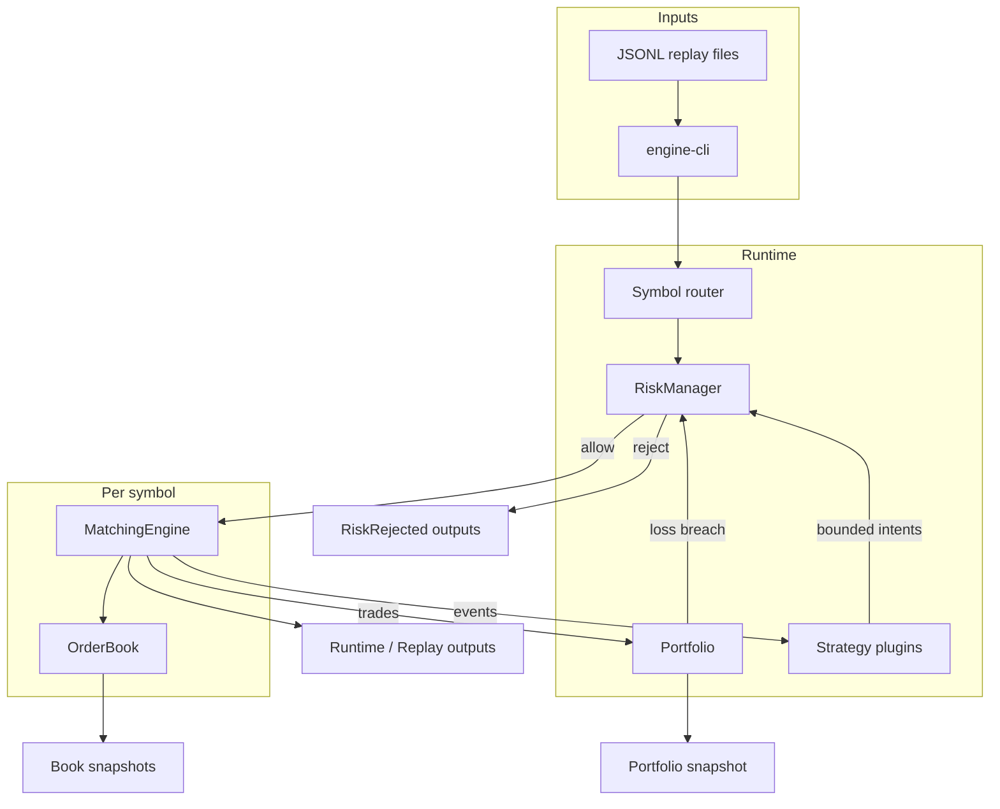

# Low-Latency Event-Driven Trading Engine

A portfolio-quality Rust event-driven trading engine focused on **deterministic behavior**, **market-microstructure correctness**, explicit invariants, and reproducible tests. The project name describes the domain; it does **not** claim measured low latency or exchange-grade performance.

## Pitch

This repository demonstrates how to build a correct, testable matching engine and extend it into a full simulated trading stack: limit order book, portfolio accounting, pre-trade risk and kill switch, strategy plugins, multi-symbol routing, Criterion benchmarks, a naive Python baseline, property-based tests, and isolated elite experiments (order pool, lock-free queue). Every design choice prioritizes correctness and reproducibility over speed claims.

**What it is:** an educational, recruiter-ready systems project with golden-file replay, integration tests, and conservative performance reporting.

**What it is not:** a profitable trading bot, investment advice, production trading infrastructure, or a system connected to real capital or an exchange.

## Feature matrix

| Area | Status | Notes |
| --- | --- | --- |
| Limit order book | Done | Ordered bid/ask ladders, FIFO price levels, active order index |
| Matching engine | Done | Limit, market, cancel; partial fills; price-time priority |
| Deterministic replay | Done | JSONL in/out, strict sequence validation, golden tests |
| Portfolio & P&L | Done | Average-cost positions, cash, realized/unrealized P&L, equity |
| Risk & kill switch | Done | Pre-trade limits; post-trade loss trip; cancels after kill |
| Runtime orchestration | Done | Symbol router, strategy callbacks, bounded command budget |
| Strategies | Done | `market_making`, `momentum` demos (not profitability claims) |
| Multi-symbol replay | Done | Interleaved events, per-symbol books, shared portfolio |
| Criterion benchmarks | Done | Hot path, workloads, replay, runtime; `BENCH_FULL=1` for full runs |
| Latency & throughput metrics | Done | hdrhistogram percentiles; bench-only wall clock |
| Python baseline | Done | Naive dict/list LOB for relative comparison |
| Property-based tests | Done | proptest invariants on matching and book state |
| Elite experiments | Done | `order_pool`, `lockfree_queue` features (isolated) |
| CI & verify script | Done | fmt, clippy, tests, release tests, bench compile, smoke checks |

## Architecture



See [docs/architecture.md](docs/architecture.md) and [docs/architecture.mmd](docs/architecture.mmd) for the full diagram source.

## Quick start

**Prerequisites:** Rust stable (2021 edition), optionally Python 3 with `matplotlib` for charts.

```bash
# Build
cargo build --release

# Run the full verification suite (recommended before sharing)
chmod +x scripts/verify_final.sh
./scripts/verify_final.sh

# Interactive demo
chmod +x scripts/demo.sh
./scripts/demo.sh
```

## Build and test

From the repository root:

```bash
cargo fmt --check
cargo clippy --workspace --all-targets --all-features -- -D warnings
cargo test --workspace --all-targets --all-features
cargo test --workspace --release
cargo bench --workspace --no-run
```

Elite feature flags compile and test separately:

```bash
cargo test -p engine --features order_pool
cargo test -p engine --features lockfree_queue
```

## Deterministic replay demo

Replay reads one JSONL event per line and drives the matching engine (or multi-symbol runtime with `--multi`):

```bash
cargo run --release --bin engine-cli -- replay data/scenarios/basic_cross.jsonl
```

Summary on stderr; events on stdout:

```bash
cargo run --release --bin engine-cli -- replay data/scenarios/basic_cross.jsonl --summary-only
```

Verify determinism (identical bytes on two runs):

```bash
cargo run --release --bin engine-cli -- replay data/scenarios/basic_cross.jsonl > /tmp/a.jsonl
cargo run --release --bin engine-cli -- replay data/scenarios/basic_cross.jsonl > /tmp/b.jsonl
cmp /tmp/a.jsonl /tmp/b.jsonl
```

Multi-symbol path:

```bash
cargo run --release --bin engine-cli -- replay data/scenarios/multi_symbol_interleaved.jsonl --multi --summary-only
```

See [docs/replay.md](docs/replay.md) for input/output schemas and the golden scenario suite.

## Strategy demo

Run built-in strategies through the runtime (`market_making` or `momentum`):

```bash
cargo run --release --bin engine-cli -- strategy-replay \
  data/scenarios/market_making_seed.jsonl \
  --strategy market_making \
  --summary-only

cargo run --release --bin engine-cli -- strategy-replay \
  data/scenarios/momentum_seed.jsonl \
  --strategy momentum \
  --portfolio
```

Strategies observe read-only context and emit bounded intents; they never bypass risk. See [docs/strategies.md](docs/strategies.md).

## Risk demo

Pre-trade rejection via CLI (`max_order_qty`):

```bash
cargo run --release --bin engine-cli -- strategy-replay \
  data/scenarios/market_making_seed.jsonl \
  --strategy market_making \
  --max-order-qty 1 \
  --summary-only
```

Expect elevated `risk_rejected` counts; rejected orders do not mutate the book or portfolio. Kill-switch behavior is covered in integration tests — see [docs/risk.md](docs/risk.md).

## Benchmarks

Compile benchmarks (CI-safe, no long measurements):

```bash
cargo bench --workspace --no-run
```

Smoke run (exits immediately unless opted in):

```bash
cargo bench -p engine --bench engine_hot_path
```

Full Criterion measurements (machine-specific; can take minutes):

```bash
BENCH_FULL=1 cargo bench -p engine --bench engine_hot_path
```

Optional: write `out/bench_summary.json` from bench helpers, then generate charts:

```bash
python3 scripts/generate_charts.py
```

See [docs/performance.md](docs/performance.md) and [docs/benchmark_report.md](docs/benchmark_report.md).

## Profiling

Flamegraph helper (documents blockers if tools or permissions are missing):

```bash
chmod +x scripts/profile_flamegraph.sh
./scripts/profile_flamegraph.sh
```

Manual attempt after installing `cargo-flamegraph`:

```bash
BENCH_FULL=1 cargo flamegraph --bench engine_hot_path -o docs/artifacts/flamegraph.svg
```

Profiling uses wall-clock time and is **not** part of deterministic engine behavior.

## Python baseline

Naive dict/list limit order book for relative throughput comparison:

```bash
python3 python/baseline_lob.py --events 10000
```

Optional dependencies: `pip install -r python/requirements.txt` (matplotlib only needed for chart generation).

## Chart generation

```bash
python3 scripts/generate_charts.py
```

Writes PNGs under `docs/artifacts/` when `out/bench_summary.json` exists; otherwise creates clearly labeled placeholders (no fabricated numbers).

## Documentation map

| Document | Contents |
| --- | --- |
| [docs/architecture.md](docs/architecture.md) | Full system architecture |
| [docs/portfolio.md](docs/portfolio.md) | Portfolio accounting model |
| [docs/risk.md](docs/risk.md) | Risk limits and kill switch |
| [docs/strategies.md](docs/strategies.md) | Strategy plugin interface and demos |
| [docs/performance.md](docs/performance.md) | Benchmarks, metrics, profiling |
| [docs/demo.md](docs/demo.md) | Step-by-step demo walkthrough |
| [docs/replay.md](docs/replay.md) | Replay formats and scenarios |
| [docs/design_notes.md](docs/design_notes.md) | Design principles and tradeoffs |
| [docs/benchmark_report.md](docs/benchmark_report.md) | Benchmark report template |
| [docs/artifacts/dashboard.html](docs/artifacts/dashboard.html) | Static report shell |

## Limitations

- **No live trading:** no exchange adapter, persistence, or real-capital integration.
- **No profitability claims:** demonstration strategies are examples only.
- **No exchange-grade latency claims:** benchmark numbers are environment-specific.
- **Single-process, deterministic core:** production concurrency is not modeled.
- **Integer ticks only:** no floating-point prices in the matching path.
- **Batch replay:** full input validated in memory; no streaming checkpoint resume.
- **Elite modules are experimental:** `order_pool` and `lockfree_queue` are isolated behind features.

## Future work

- Schema versioning and migration for replay JSONL
- Additional strategy examples and property tests on runtime paths
- Richer benchmark export pipeline into `out/bench_summary.json`
- Optional persistence and audit log for replay outputs
- Further elite experiments (always behind features, never in the default path)

## Machine disclosure

Benchmark latency, throughput, and Python baseline numbers depend on CPU, OS, and compiler version. Results in [docs/benchmark_report.md](docs/benchmark_report.md) and generated charts are **machine-specific**. Regenerate on your hardware with the commands above; do not treat any sample numbers as universal performance guarantees.

## License

See repository license file if present; otherwise treat as portfolio source for review purposes.
